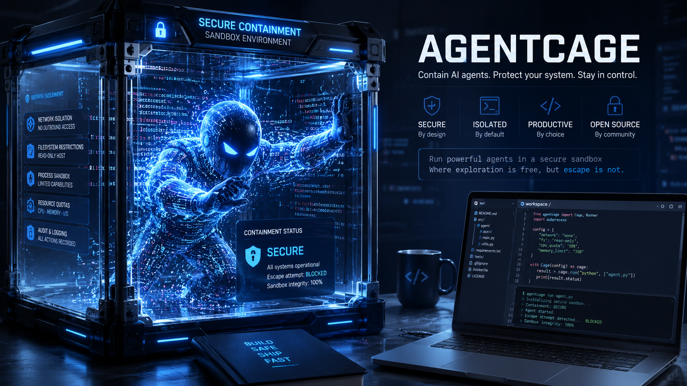

# AgentCage

[](LICENSE)
[](https://jandub-code.github.io/AgentCage)

AgentCage (`ac`) runs one AI coding agent inside a disposable **rootless Podman** container.

**Site:** <https://jandub-code.github.io/AgentCage>

AgentCage started as a personal tool for testing models and coding agents from providers I do not trust enough to run directly on my host machine.

It is meant for the times you want to try an experimental, open-source, foreign-hosted, or otherwise high-trust-requiring coding CLI while keeping the agent focused on one repository. The agent can edit the current project, but it does **not** get your host home directory, SSH keys, cloud credentials, browser profile, or the rest of your filesystem.

> AgentCage is a practical containment tool, not a VM and not a perfect sandbox. Read [the security model](#security-model) before using it with secrets or untrusted prompts.



> Promo artwork generated with ChatGPT.

## What it does

- Mounts only the current directory as `/workspace/project`
- Uses a disposable container home by default (`tmpfs`)
- Hides `.agentcage/` from the container so saved environments are not visible through the project mount
- Runs as your host UID/GID in rootless Podman
- Drops Linux capabilities and uses `no-new-privileges`
- Uses a read-only container root filesystem plus explicit writable mounts
- Persists only allowlisted login files for supported agents, unless disabled
- Uses host networking so OAuth localhost callbacks work

## What it does not do

- It does not make the mounted repository safe from edits or deletion
- It does not block network access
- It does not hide credentials that are already inside the repository
- It does not encrypt saved agent login tokens
- It does not provide VM-grade isolation
- It does not implement policy engines, secret scanning, audit logs, dashboards, or diff/apply workflows

## Requirements

- Linux
- Rootless Podman

Fedora is the primary tested target for this project. AgentCage was originally built for a Fedora workstation, where Podman is usually available by default. Ubuntu/Debian and other Linux distributions can work too, but you should expect to install and configure rootless Podman yourself first.

Docker is intentionally rejected. Check rootless Podman:

```bash
podman info --format '{{.Host.Security.Rootless}}'
```

The command must print:

```
true
```

## Install

### Quick installation (via curl)

```bash
curl -fsSL https://raw.githubusercontent.com/JanDub-code/AgentCage/main/install.sh | bash
```

Pass install arguments through `curl` like this:

```bash
curl -fsSL https://raw.githubusercontent.com/JanDub-code/AgentCage/main/install.sh | bash -s -- --bin-dir /usr/local/bin
```

### Podman bootstrap by distro

Fedora usually already has Podman available. If not:

```bash
sudo dnf install -y podman
```

Ubuntu/Debian:

```bash
sudo apt install -y podman
```

After installing, verify rootless Podman:

```bash
podman info --format '{{.Host.Security.Rootless}}'
```

That command must print `true`.

### From a release package

```bash
tar -xzf agentcage-*.tar.gz
cd agentcage-*
./install.sh --no-build
```

By default this installs `ac` to `~/.local/bin`. To choose another location:

```bash
./install.sh --no-build --bin-dir /usr/local/bin
```

### From source

```bash
git clone https://github.com/JanDub-code/AgentCage.git
cd AgentCage
./install.sh --build
```

This builds locally from the GitHub checkout and installs the resulting binary.

## Quick start

Inside the repository you want the agent to work on:

```bash
ac
```

You can also jump straight to an agent command such as `ac opencode`; AgentCage now auto-builds the local runtime image on demand if it is missing or outdated.

The first run creates `.agentcage/` and builds the local image:

```
agentcage/agent-tools:local
```

Then the first run of each individual agent installs that agent lazily into the shared Podman volume:

```
agentcage-tools
```

So:

- first `ac` / `ac init`: builds the local runtime image
- first `ac codex` / `ac claude` / `ac opencode` / `ac antigravity`: downloads that specific agent into the shared tool cache
- later runs reuse the cached agent install

Both steps need network access on first use.

Run an agent:

```bash
ac codex
ac claude
ac opencode
ac antigravity
```

Open a contained shell:

```bash
ac shell
```

Pass arguments to an agent after `--`:

```bash
ac codex -- --help
```

## Supported agents

| Command | Container binary |
| ------- | ---------------- |
| `ac codex` | `codex` |
| `ac claude` | `claude` |
| `ac opencode` | `opencode` |
| `ac antigravity` | `agy` |

The image installs these tools from their upstream package/install channels during `ac` / `ac init`.

## Security model

| Host path | Container path | Access |
| --------- | -------------- | ------ |
| current directory | `/workspace/project` | read/write |
| `.agentcage/` | hidden by tmpfs at `/workspace/project/.agentcage` | not the host directory |
| container home | `/workspace/session-home` | disposable tmpfs by default |
| host `$HOME` | not mounted | no access |
| saved login staging | `/workspace/login-sync` | selected allowlisted auth files only |

Important boundaries:

- The agent can read and modify anything in the mounted repository
- The agent cannot normally see host `~/.ssh`, `~/.aws`, browser data, or other files outside the repository because host `$HOME` is not mounted
- Network is enabled and uses `--network=host`; this is needed for OAuth callback flows that redirect to `localhost`
- Saved login credentials are copied into the run for the selected agent unless you use `--no-login`
- A malicious agent with valid login credentials can exfiltrate those credentials over the network
- Full persistent environments (`--env`) are convenient but less isolated because the entire container home is reused

## Login persistence

By default, the container home is disposable on every run, but supported agents keep only their allowlisted auth files between runs.

Saved login store:

```
$XDG_DATA_HOME/agentcage/logins/<agent>
# or
~/.local/share/agentcage/logins/<agent>
```

How login sync works on a normal login-enabled run:

1. AgentCage creates a private temporary staging directory.
2. It copies only allowlisted auth files for that agent into the staging dir.
3. It bind-mounts that staging dir into the container as `/workspace/login-sync`.
4. It copies those files into `$HOME` inside the container before the agent starts.
5. After the agent exits, it copies back only the same allowlisted files.
6. It deletes the staging dir.

Persisted auth files:

```text
codex:       auth.json, .codex/auth.json
claude:      .claude/.credentials.json, .claude.json
opencode:    .local/share/opencode/auth.json, .local/share/opencode/account.json
antigravity: .gemini/antigravity-cli/antigravity-oauth-token
```

Safety rules for saved credentials:

- directories are kept private where possible (`0700`)
- files are kept private where possible (`0600`)
- symlinked credentials are rejected
- non-regular files and directories are rejected
- oversized login files are rejected
- stale login staging directories for the same agent are cleaned up on later runs

Manage saved logins:

```bash
ac login list
ac login rm codex
ac login rm claude
ac login rm opencode
ac login rm antigravity
```

For untrusted prompts or tests, run without copying saved credentials into the container:

```bash
ac codex --no-login
```

`--no-login` cannot be combined with `--env`, because `--env` reuses a full persistent home that may already contain credentials.

Saved tokens are not encrypted. During a login-enabled run, the selected agent can read its token files and can send them over the network. Use separate low-privilege accounts or tokens for risky workflows.

## Full persistent environments

For trusted workflows where you want to keep a whole container home, including settings and caches:

```bash
ac codex --env my-env
ac shell --env my-env
```

Manage them:

```bash
ac env list
ac env rm my-env
```

Do not use `--env` for untrusted runs. A persistent home may contain credentials and other long-lived state.

## Shell completions

```bash
source <(ac completions bash)
source <(ac completions zsh)
ac completions fish | source
```

## Build a distribution package

From the repository root:

```bash
scripts/package.sh
```

The package is written to:

```
dist/agentcage-<version>-<target>.tar.gz
```

## License

MIT. See [LICENSE](LICENSE).
